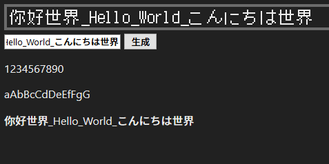
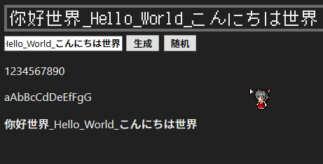

# pixel_font_cavans

一个基于 [victorporof/BDF.js](https://github.com/victorporof/BDF.js/) 与 [SolidZORO/zpix-pixel-font](https://github.com/SolidZORO/zpix-pixel-font) 输出到 HTML canvas 像素字体的网页程序。

点击进入在线演示: [pixel_font_cavans](https://gledos.science/pixel_font_cavans/)

## 目前情况

现在是相当早期的版本，支持显示的字符

+ 正常显示
  + 汉字
  + 数字
  + 大小写字母
+ 显示位置有误
  + 许多的符号
  + 日语中的片假名与平假名
+ 无法显示
  + 空格

## LICENSE

victorporof/BDF.js 使用的是 MPL-2.0 License，SolidZORO/[SolidZORO](https://github.com/SolidZORO) 拥有 zpix-pixel-font 字体的完全自主智慧财产权。

为了确保本网页程序仅用于免费非商业，所以使用了 GPL-3.0 License 协议。[^1]

[^1]: [Is is available for project under GPL 3? · Issue #23 · SolidZORO/zpix-pixel-font](https://github.com/SolidZORO/zpix-pixel-font/issues/23)
